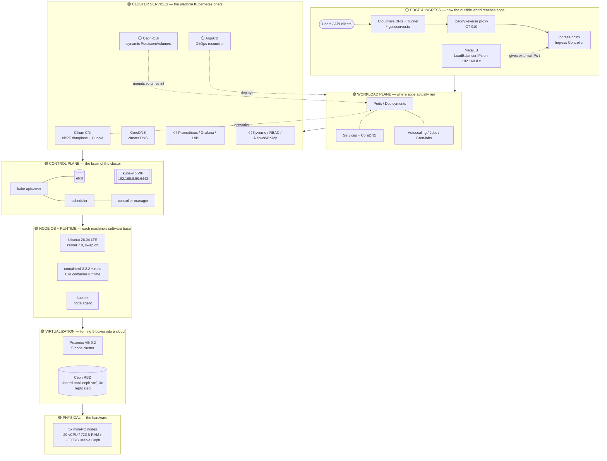
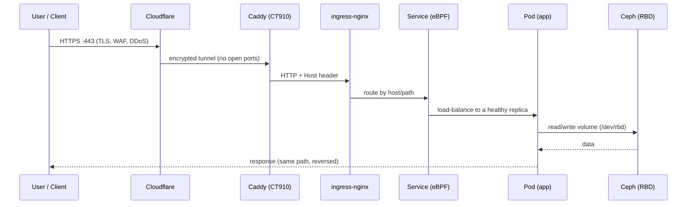
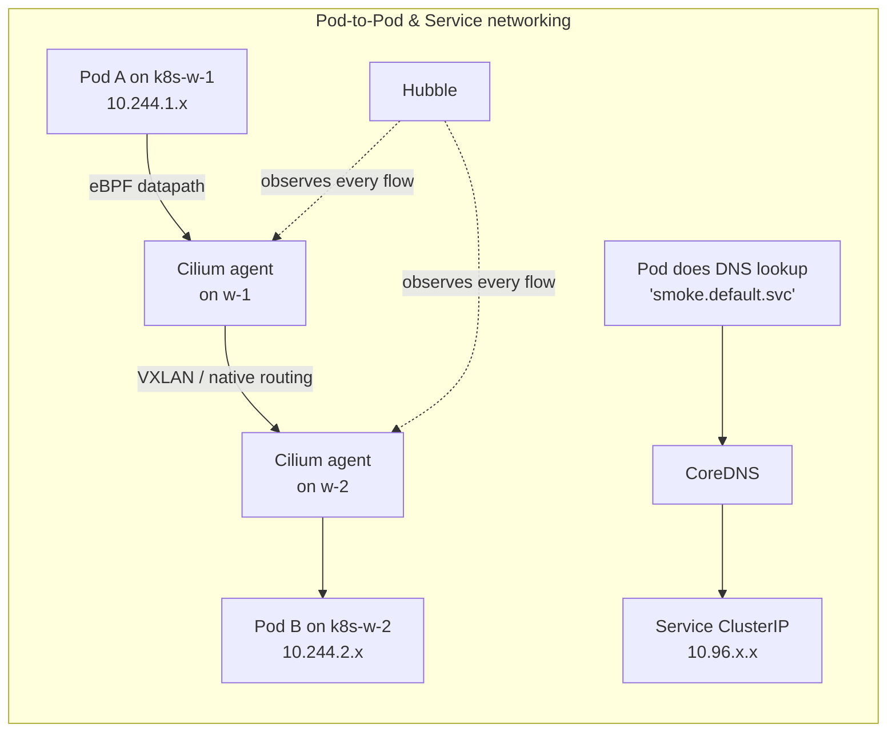
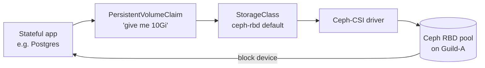
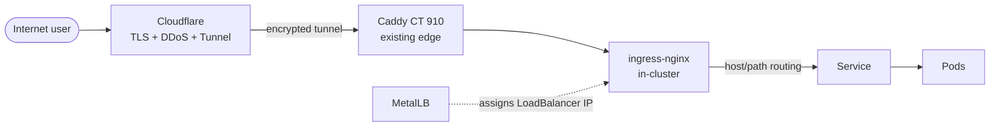
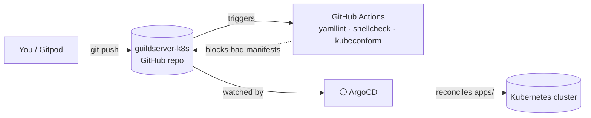

# Guild-A Kubernetes Platform — Architecture

A complete, layer-by-layer description of the self-hosted Kubernetes platform running on
the **Guild-A** Proxmox cluster: what each component is, **why** it's here, **which
enterprise problem it solves**, and **what it depends on**. Components are tagged
**🟢 LIVE** (built and verified) or **⚪ ROADMAP** (designed, not yet deployed).

---

## 1. Executive summary

This platform turns five commodity mini-PCs into the same kind of Kubernetes environment a
company runs in production. It is built with **kubeadm** (the vendor-neutral, reference way
to build Kubernetes) so every skill transfers directly to AWS EKS, GKE, AKS, RKE2, or a
bank's on-prem cluster. It runs on real shared storage (**Ceph**), uses a modern eBPF
network dataplane (**Cilium**), presents a **highly-available API endpoint** from day one,
and is managed as **infrastructure-as-code in Git** with CI/CD — not by hand.

The guiding principle: **nothing is a pet.** Every node is reproducible from a script,
every workload is a manifest in Git, and the whole thing is designed to grow from 3 nodes
to a full HA cluster without re-architecting.

---

## 2. The big picture



**How to read it:** a request enters at the top (Edge), is routed to a Pod (Workload
Plane), which relies on Cluster Services (networking, storage, DNS) that are orchestrated
by the Control Plane, all running on the Node OS, hosted on virtualized hardware. Each
layer below is a dependency of the layer above.

### 2a. Communication flow — how the components talk

**Request lifecycle** (north–south: a user's request reaching an app and its data):



**Control loop** (how the cluster runs itself — declared state reconciled into reality):

```mermaid
flowchart LR
    KC[kubectl / ArgoCD] -->|HTTPS :6443 via VIP .59| API[kube-apiserver]
    API <-->|gRPC :2379| ETCD[(etcd · local NVMe)]
    SCH[scheduler] -->|watch / update| API
    CM[controllers] -->|watch / update| API
    KL[kubelet ×3] -->|watch| API
    KL -->|CRI gRPC| CRI[containerd → Pods]
    KV[kube-vip] -.advertises VIP .59 via ARP.-> API
    CIL[Cilium agents] -->|watch| API
    CIL <-->|eBPF · VXLAN| CIL2[other nodes]
    CSI[Ceph-CSI] -->|RBD :6789| MON[(Ceph mons)]
```

Every subsystem is the same pattern: **declare intent to the API server → a controller
reconciles reality to match.** Storage, networking, ingress, and GitOps are all just more
controllers watching the same API.

---

## 3. Layer 1–2 — Physical & Virtualization  🟢 LIVE

### Proxmox VE (5-node cluster)
- **What:** An open-source virtualization platform (KVM/QEMU + LXC) clustering five
  physical mini-PCs into one management plane.
- **Why:** It's the "private cloud" underneath everything — it lets us carve VMs out of raw
  hardware, live-migrate them between nodes, and manage them by API.
- **Enterprise problem solved:** *Hardware consolidation and resource pooling* — the same
  reason enterprises run VMware vSphere or a cloud provider's hypervisor. Kubernetes nodes
  are VMs so they're disposable and reproducible, not tied to a physical box.
- **Depends on:** the 5 physical machines; a shared L2 network (`vmbr0`, 192.168.8.0/24).

### Ceph (distributed storage)
- **What:** A software-defined storage system pooling disks across nodes into one
  fault-tolerant cluster. Exposed here as an **RBD** (block) pool named `ceph-vm`,
  **3× replicated** (any one node can die without data loss).
- **Why:** Shared storage is what makes VMs (and later, Kubernetes volumes) portable — a VM
  on shared storage can migrate or restart on any node.
- **Enterprise problem solved:** *Resilient, network-attached storage without a SAN.* This
  is the same role as AWS EBS or a NetApp array. Crucially, it becomes the backend for
  Kubernetes persistent volumes in Phase 5 — stateful apps (databases) get real durable
  storage.
- **Depends on:** OSDs (disks) on nodeA/B/C/D; monitors on nodeE/A/B.

---

## 4. Layer 3 — Node OS & Container Runtime  🟢 LIVE

Three VMs form the cluster, all cloned from one golden Proxmox template for identical,
reproducible nodes:

| VM | Role | vCPU | RAM | IP |
|----|------|------|-----|-----|
| k8s-cp-1 | control-plane | 2 | 4 GB | 192.168.8.60 |
| k8s-w-1 | worker | 2 | 6 GB | 192.168.8.61 |
| k8s-w-2 | worker | 2 | 6 GB | 192.168.8.62 |

### Ubuntu 26.04 LTS
- **What:** The node operating system (kernel 7.0).
- **Why / enterprise fit:** An LTS Linux is the standard k8s node base. **Swap is disabled**
  and kernel modules (`overlay`, `br_netfilter`) + sysctls (`ip_forward`,
  `bridge-nf-call-iptables`) are set — mandatory prerequisites the kubelet enforces so pod
  networking and the cgroup/memory model behave deterministically.

### containerd 2.2.2 + runc 1.4.0
- **What:** The **container runtime**. containerd manages image pull and container
  lifecycle via the CRI (Container Runtime Interface); runc is the low-level OCI runtime
  that actually spawns the Linux container.
- **Why:** Kubernetes removed built-in Docker support years ago; containerd is the
  production-standard CRI runtime (what EKS/GKE/AKS use under the hood). Configured with
  `SystemdCgroup=true` so kubelet and the runtime agree on one cgroup manager — a mismatch
  causes subtle instability under load.
- **Enterprise problem solved:** *Standardized, lightweight, secure container execution.*
- **Depends on:** the node OS; the pinned `pause:3.10.2` sandbox image.

### kubelet
- **What:** The per-node Kubernetes agent. It watches the API for pods assigned to its node
  and drives containerd to run them; reports node/pod health back.
- **Why:** It's the hands of the control plane on every machine. Installed pinned to
  **v1.36** and `apt-mark hold`'d so nodes never drift versions unexpectedly (upgrades
  become deliberate, not accidental).

---

## 5. Layer 4 — Control Plane  🟢 LIVE

Bootstrapped with **kubeadm v1.36.3**.

### etcd
- **What:** The distributed key-value store that holds *all* cluster state (every object,
  config, secret). The single source of truth.
- **Enterprise problem solved:** *Consistent, replicated cluster state.* In HA it runs as a
  Raft quorum across control-plane nodes; today it's one instance (grows to 3 in Phase 10).

### kube-apiserver
- **What:** The front door to the cluster — the only component that talks to etcd. Every
  `kubectl`, controller, and kubelet action is a REST call to the apiserver.
- **Enterprise problem solved:** *A single, authenticated, audited API for all cluster
  operations* — the integration point for RBAC, admission control, and automation.

### scheduler & controller-manager
- **scheduler:** decides which node each new pod runs on (resources, affinity, taints).
  Proven live — our smoke test spread 2 replicas across both workers automatically.
- **controller-manager:** runs the reconciliation loops (Deployments→ReplicaSets→Pods, node
  lifecycle, etc.) that make Kubernetes *declarative* — you state desired state, controllers
  make reality match.

### kube-vip — the HA API endpoint  🟢 LIVE
- **What:** A tiny pod that advertises a **virtual IP (`192.168.8.59`)** via ARP and points
  it at a healthy kube-apiserver. The cluster's API endpoint is this VIP, not any one node's
  IP.
- **Why this matters enormously:** the whole cluster (worker kubelets, Cilium agents,
  kubeconfig, future control-plane nodes) targets `192.168.8.59:6443`. Because that address
  is **decoupled from any single node**, we can add control-plane nodes for HA later
  **without re-issuing certificates or reconfiguring a single client.** Doing this on day
  one is the difference between "grows to HA in an afternoon" and "rebuild the cluster."
- **Enterprise problem solved:** *No single point of failure at the API layer* — the role a
  cloud load balancer plays in front of managed control planes.
- **Config note:** on a single control-plane node, kube-vip's leader election is
  **disabled** (`vip_leaderelection=false`) so it holds the VIP unconditionally; it gets
  re-enabled when the control plane grows to 3 nodes. (See the incident write-up in the repo
  history — leaving LE on caused the VIP to flap under load.)

---

## 6. Layer 5 — Networking  🟢 LIVE



### Cilium (CNI) — the network dataplane
- **What:** The Container Network Interface plugin. It gives every pod an IP (from
  `10.244.0.0/16`), routes pod-to-pod traffic across nodes, and enforces network policy —
  all using **eBPF** (programs run in the Linux kernel) instead of slower iptables chains.
- **Why Cilium:** it's the modern enterprise CNI (used by Google GKE Dataplane V2, AWS, many
  banks). eBPF gives high throughput, identity-based security, and deep observability.
- **Enterprise problem solved:** *Scalable, secure, observable pod networking* — plus it's
  the enforcement point for zero-trust NetworkPolicies (Phase 9).
- **Depends on:** a modern kernel (7.0 here — ideal for eBPF); the kube-apiserver (reached
  via the VIP).

### CoreDNS
- **What:** In-cluster DNS. Resolves Service names (`myapp.namespace.svc.cluster.local`) to
  ClusterIPs so pods find each other by name, not IP.
- **Enterprise problem solved:** *Service discovery* — apps reference dependencies by stable
  names even as pods come and go. Verified live in the smoke test.

### kube-proxy
- **What:** Programs the Service→Pod load-balancing rules on each node. Retained for a
  reliable first bring-up (**roadmap:** replace with Cilium's eBPF kube-proxy replacement
  for lower latency).

### Hubble  🟢 LIVE
- **What:** Cilium's observability layer — a UI and CLI that shows **live network flows**,
  service dependency maps, and dropped-packet reasons.
- **Enterprise problem solved:** *Network visibility and troubleshooting* ("why can't
  service A reach service B?") — usually a blind spot in self-managed clusters.

---

## 7. Layer 5 — Storage  🟢 LIVE (Phase 5)



### Ceph-CSI
- **What:** A driver that lets Kubernetes dynamically carve volumes out of the existing
  Guild-A Ceph cluster. A pod asks for storage via a `PersistentVolumeClaim`; Ceph-CSI
  provisions an RBD image and mounts it into the pod — no manual disk work.
- **Why it's special here:** most homelabs fake persistent storage (hostPath/local). This
  cluster gets **real, replicated, network-attached block storage** because Ceph already
  exists. Stateful workloads (databases, queues) can run for real.
- **Enterprise problem solved:** *Dynamic, durable, self-service storage for stateful apps*
  — the role of AWS EBS CSI or a storage vendor's driver.
- **Live status:** ceph-csi-rbd v3.17.0 installed against a dedicated `k8s-rbd` pool
  (`size=3`) with a scoped `client.k8s` cephx user. Verified end-to-end: a `PVC` bound,
  ceph-csi created the RBD image in the Ceph pool, and a pod read/wrote it via `/dev/rbd0`.
  Config in [`infra/ceph-csi/`](../infra/ceph-csi/).

---

## 8. Layer 7 — Edge & Ingress  🟢 LIVE (Phase 6)



### MetalLB
- **What:** Gives `type: LoadBalancer` Services a real IP on the LAN (192.168.8.x) —
  something cloud providers do automatically but bare-metal clusters lack.
- **Enterprise problem solved:** *On-prem load-balancer provisioning* so Services are
  reachable like they would be in the cloud.

### ingress-nginx
- **What:** The cluster's HTTP(S) ingress controller — routes external requests to Services
  by hostname/path, terminates TLS, does rewrites.
- **Enterprise problem solved:** *One managed entry point for many apps* (`app1.example.com`,
  `app2.example.com`) instead of a port per service.

### Cloudflare Tunnel + Caddy (existing Guild-A edge)
- **What:** The public edge already fronting `*.guildserver.io`. Kubernetes ingress plugs
  into it, so cluster apps get public HTTPS URLs without opening firewall ports.
- **Enterprise problem solved:** *Secure public exposure with TLS and DDoS protection at the
  edge.*

**Live status:** MetalLB (L2, pool `.63-.69`) + ingress-nginx (pinned to `192.168.8.63`,
default IngressClass) are installed; a Caddy route sends `k8s.guildserver.io` to the ingress
LB IP. Verified: **`https://k8s.guildserver.io` returns 200 through Cloudflare**, load-
balanced across both workers. Config in [`infra/metallb/`](../infra/metallb/),
[`infra/ingress-nginx/`](../infra/ingress-nginx/), demo in [`apps/demo/`](../apps/demo/).

---

## 9. GitOps & CI/CD  🟢 LIVE (Phase 7)



- **This repository** is the source of truth: node prep, control-plane bootstrap, and CNI
  install are all scripts; platform config (Cilium values) is declarative YAML.
- **GitHub Actions (LIVE):** every push runs YAML lint, shellcheck, and `kubeconform`
  manifest validation — bad config is caught before it reaches the cluster.
- **Gitpod (LIVE):** a one-click browser IDE preloaded with `kubectl`/`helm`/`cilium`/`k9s`.
- **ArgoCD (LIVE):** watches this repo via an **app-of-apps** root (`argocd/applications/`)
  and continuously reconciles Git → cluster, so **`git push` is the deploy mechanism** and
  the cluster self-heals to match Git. UI at `https://argocd.guildserver.io`. Verified: a
  replica bump committed to Git was reconciled into the cluster automatically. Config in
  [`infra/argocd/`](../infra/argocd/) and [`argocd/`](../argocd/).
- **Enterprise problem solved:** *Auditable, repeatable, reviewable change management* — no
  snowflake clusters, every change is a reviewed commit with a CI gate.

---

## 10. Observability  🟢 LIVE (Phase 8)

- **kube-prometheus-stack** (Prometheus + Grafana + exporters): metrics, dashboards for
  nodes, control plane, and apps. Deployed **via ArgoCD** (GitOps). Prometheus scrapes 19+
  targets, 5-day retention on an 8 Gi Ceph volume. Alertmanager trimmed to save footprint on
  the small cluster (re-enable when scaling).
- **Loki + Promtail:** centralized log aggregation; Promtail ships every node's logs to Loki
  (8 Gi Ceph volume). Wired into Grafana as a datasource.
- **Grafana:** live at `https://grafana.guildserver.io` (admin creds in the vault, not Git);
  Prometheus is the default datasource, Loki secondary.
- **Enterprise problem solved:** *Know what the cluster is doing and get paged before users
  notice* — the monitoring/alerting/SLO backbone. (Hubble already covers network flows.)
- Config in [`argocd/applications/kube-prometheus-stack.yaml`](../argocd/applications/kube-prometheus-stack.yaml)
  and [`loki.yaml`](../argocd/applications/loki.yaml).

---

## 11. Security & Policy  🟢 LIVE (Phase 9)

- **RBAC (live):** a `developer` ServiceAccount with a namespaced read-only Role — verified:
  it can read pods in `demo` but cannot delete them, cannot touch `kube-system`, and cannot
  read secrets. The least-privilege template for real human/CI identities.
- **NetworkPolicies via Cilium (live):** the `demo` namespace is **default-deny ingress**
  plus an explicit allow from ingress-nginx. Verified: the public app still serves (200)
  while a pod in another namespace is **blocked** from reaching demo — zero-trust proven.
- **Kyverno (live, audit mode):** 4 ClusterPolicies — require requests/limits, disallow
  `:latest`, disallow privileged, require an `owner` label — auditing all workloads (238
  violations flagged). Flip to Enforce once the cluster is clean.
- **Secrets:** all sensitive values (cephx key, Grafana/ArgoCD admin) are kept **out of Git**
  in the credentials vault and referenced via `existingSecret`. Next step for GitOps secrets:
  **sealed-secrets** (encrypted secrets safe to commit).
- **Enterprise problem solved:** *Compliance and blast-radius control* — the controls
  auditors and security teams require (maps to CIS Kubernetes Benchmark expectations).
- Config in [`apps/security/`](../apps/security/).

---

## 12. Day-2 Operations  🟢 Velero LIVE · ⚪ HA growth / upgrades optional (Phase 10)

- **Velero (live):** backup/restore to an in-cluster **MinIO** S3 store, using File System
  Backup (node-agent/kopia) so **volume data** is captured, not just objects. Verified: a
  backup of the `stateful` namespace **Completed**, and a restore into a new namespace brought
  back the workload *and its Ceph volume data* (original file intact). Backups live in MinIO
  (`backups/`, `kopia/`). Config in [`infra/velero/`](../infra/velero/) and
  [`infra/minio/`](../infra/minio/). *(On-cluster target is fine for a demo; real DR ships
  backups off-site.)*
- **Stateful app (live):** a full end-to-end demo — GitOps → Ceph PV → ingress →
  `https://stateful.guildserver.io` → monitored → Kyverno-clean — that keeps its data across
  pod restarts (verified: killed the pod, the page's write-once timestamp survived).
- **HA growth (optional next):** add 2 more control-plane nodes (re-enabling kube-vip leader
  election) for a quorum etcd — trivial because the VIP endpoint never changes.
- **Upgrades (optional next):** practice a controlled `kubeadm upgrade` (drain → upgrade →
  uncordon).
- **Enterprise problem solved:** *Business continuity* — backups, no-single-point-of-failure,
  and safe rolling upgrades.

---

## 13. Dependency inventory

| Component | Version | Layer | Purpose | Status |
|-----------|---------|-------|---------|--------|
| Proxmox VE | 9.2 | Virtualization | Hypervisor cluster | 🟢 |
| Ceph (RBD) | pool `ceph-vm`, 3× | Storage | Shared resilient storage | 🟢 |
| Ubuntu | 26.04 LTS (kernel 7.0) | Node OS | k8s node base | 🟢 |
| containerd | 2.2.2 | Runtime | CRI container runtime | 🟢 |
| runc | 1.4.0 | Runtime | OCI low-level runtime | 🟢 |
| Kubernetes | v1.36.3 | Control plane | Orchestrator (kubeadm) | 🟢 |
| etcd | bundled | Control plane | Cluster state store | 🟢 |
| kube-vip | v1.2.1 | Control plane | HA API VIP (192.168.8.59) | 🟢 |
| Cilium | 1.19.6 | Networking | eBPF CNI + policy | 🟢 |
| Hubble | (Cilium) | Networking | Flow observability | 🟢 |
| CoreDNS | bundled | Networking | Cluster DNS | 🟢 |
| kube-proxy | bundled | Networking | Service load-balancing | 🟢 |
| Helm | 3.21 | Tooling | Package manager | 🟢 |
| GitHub Actions | — | CI/CD | Lint/validate manifests | 🟢 |
| Gitpod | — | Dev env | Browser k8s toolbox | 🟢 |
| Ceph-CSI | 3.17.0 | Storage | Dynamic PVs on `k8s-rbd` pool | 🟢 |
| MetalLB | (L2) | Edge | Bare-metal LoadBalancer (pool .63-.69) | 🟢 |
| ingress-nginx | — | Edge | HTTP ingress (LB .63, default class) | 🟢 |
| ArgoCD | (Helm) | GitOps | Git→cluster reconcile (app-of-apps) | 🟢 |
| kube-prometheus-stack | 87.19.1 | Observability | Metrics + Grafana dashboards | 🟢 |
| Loki + Promtail | 2.10.3 | Observability | Centralized logs | 🟢 |
| Kyverno | 3.8.2 | Security | Admission policy (audit) | 🟢 |
| NetworkPolicy (Cilium) | — | Security | Zero-trust east-west | 🟢 |
| RBAC | — | Security | Least-privilege access | 🟢 |
| Velero | 12.1.0 | Day-2 | Backup/restore (FSB) | 🟢 |
| MinIO | — | Day-2 | S3 backend for Velero | 🟢 |

---

## 14. Enterprise workload mapping — "can it do what a real company needs?"

| Enterprise need | How this platform delivers it |
|-----------------|-------------------------------|
| Run containerized microservices at scale | Deployments + Services + scheduler across worker nodes (🟢 proven) |
| Highly-available, no-SPOF control | kube-vip VIP now; 3-node etcd quorum in Phase 10 (🟢/⚪) |
| Stateful apps (databases, queues) | Ceph-CSI dynamic PersistentVolumes on replicated Ceph (⚪) |
| Public web apps with TLS | Cloudflare edge → ingress-nginx → Services (⚪) |
| Zero-downtime deploys & rollbacks | Rolling updates + ArgoCD GitOps history (🟢/⚪) |
| Auditable change management | Git + PR review + CI gate (🟢) |
| Observability & alerting | Prometheus/Grafana/Loki + Hubble flows (🟢/⚪) |
| Security & compliance | RBAC + default-deny NetworkPolicy + Kyverno admission (⚪) |
| Disaster recovery | Velero backups + Ceph replication + Proxmox snapshots (⚪) |
| Elastic scaling | Add worker VMs from the golden template in minutes (🟢) |

---

## 15. Known limitations & planned hardening

**Control-plane I/O fragility.** The control-plane VM (cp-1: 2 vCPU / 4 GB) has its root
disk on Ceph RBD, and etcd's latency-sensitive fsyncs share that disk with container image
unpacking. Under a sustained I/O burst (e.g. pulling large images during an install), cp-1
hits very high iowait, etcd/apiserver stall, and kube-vip briefly drops the VIP — causing a
short API flap that cascades into leader-election restarts (cilium-operator, CSI sidecars).
It self-recovers in seconds and steady state is stable, but it interrupts heavy installs.

*Mitigations in place:* a direct-to-node kubeconfig (`config-direct`, server `…8.60:6443`)
keeps `kubectl` working during a VIP flap; kube-vip leader election is disabled on the
single CP.

*Fix — DONE (2026-07-25):* etcd was moved onto a dedicated **local NVMe disk** on cp-1
(`/var/lib/etcd` on `/dev/sdb`, via `/etc/fstab`), and cp-1 RAM bumped to **8 GB**. etcd was
snapshot-backed-up first and the move validated with a reboot (etcd re-mounts from the local
disk on boot; commit latency dropped from ~162 ms to ~80 ms and is now isolated from Ceph
image-pull contention). This removes the fsync-latency root cause.

## 16. Current status

**🟢 Live and verified:** a 3-node Kubernetes v1.36.3 cluster (1 control-plane + 2 workers)
with an HA API VIP, Cilium eBPF networking, CoreDNS, Hubble, **Ceph-CSI dynamic storage**,
**MetalLB + ingress-nginx behind the Cloudflare edge**, **ArgoCD GitOps**, and **Prometheus +
Grafana + Loki observability**. End-to-end verified: multi-node pod scheduling, Service DNS,
cross-node pod networking, a PVC provisioning a real RBD volume from Ceph, a public app at
`https://k8s.guildserver.io`, `git push`-driven deploys, live metrics/logs dashboards at
`https://grafana.guildserver.io`, enforced **security guardrails** (Kyverno audit, zero-trust
NetworkPolicies, least-privilege RBAC), a **stateful app** persisting on Ceph at
`https://stateful.guildserver.io`, and **Velero backup/restore** (verified with volume data).

**All 10 roadmap phases are live.** Optional future work: grow the control plane to 3-node HA
(the VIP is already in place for it), practice a `kubeadm` upgrade, add sealed-secrets for
GitOps-native secrets, and flip Kyverno policies from Audit to Enforce.
