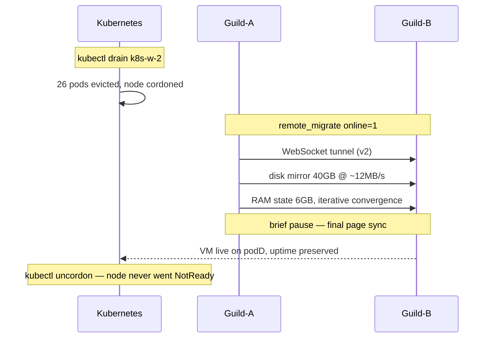

# Cross-Cluster Kubernetes Migration: Guild-A → Guild-B

**Zero-downtime live migration of a production Kubernetes cluster between two independent
Proxmox clusters, followed by full storage decoupling.**

| | |
|---|---|
| **Scope** | 3 Kubernetes nodes, 17 namespaces, 88 pods, 6 persistent volumes |
| **Workload downtime** | **None.** No node ever entered `NotReady`; VM uptime counters were preserved across the move |
| **Data loss** | None. Every volume checksum-verified before and after |
| **Rollback** | Available at every step — source VMs retained in stopped state throughout |
| **Method** | Proxmox `remote-migrate` (live) → Longhorn PVC re-hosting → Ceph-CSI decommission |

---

## 1. Why this migration happened

The Kubernetes cluster ran as three VMs on **Guild-A**, a 5-node Proxmox cluster with Ceph.
It needed to move to **Guild-B**, a second 5-node Proxmox cluster.

The driver was capacity and blast radius:

| | Guild-A | Guild-B |
|---|---|---|
| Shared storage | Ceph RBD (4 OSDs, 1.01 TB raw) | none — `local-lvm` per node |
| **Usable capacity** | **~337 GB** (`size=3` replication) | **~13 TB** across 5 nodes |
| Kubernetes PV backing | `ceph-rbd` StorageClass via Ceph-CSI | — |

Guild-A's Ceph gives 1.01 TB raw but only ~337 GB usable, because every byte is written
three times (`size=3`, `min_size=2`). That is the correct trade for VM root disks — it
survives a whole node dying — but it is an expensive place to grow into.

The deeper problem was **coupling**. Everything the cluster did — compute *and* storage —
depended on one Proxmox cluster. There was no separation of failure domains.

---

## 2. Starting state

```mermaid
flowchart TB
    subgraph GA["Guild-A — Proxmox 9.2, 5 nodes"]
        direction TB
        subgraph GAC["Ceph — 4 OSDs, 1.01TB raw, size=3"]
            CEPH[("pool: k8s-rbd<br/>pool: ceph-vm")]
        end
        VM120["VM 120 · k8s-cp-1<br/>nodeD · 8GB"]
        VM121["VM 121 · k8s-w-1<br/>nodeE · 6GB"]
        VM122["VM 122 · k8s-w-2<br/>nodeB · 6GB"]
    end

    subgraph K8S["Kubernetes v1.36.3 — 17 namespaces, 71 pods"]
        ARGO["ArgoCD<br/>app-of-apps, selfHeal"]
        MON["Prometheus · Grafana · Loki"]
        APPS["Portainer · MinIO · Ingress<br/>MetalLB · Cilium · Kyverno · Velero"]
    end

    VM120 & VM121 & VM122 -.->|"root disks"| CEPH
    K8S -->|"6 PVs via Ceph-CSI"| CEPH

    style GAC fill:#4a3728,stroke:#d4915d
    style K8S fill:#1e3a5f,stroke:#5b9bd5
```



**Platform:** Kubernetes v1.36.3 on Ubuntu 26.04, containerd 2.2.2, Cilium CNI,
kube-vip (API VIP `192.168.8.59`), single-member etcd, MetalLB, ingress-nginx,
ArgoCD app-of-apps with `selfHeal: true` and `prune: true`, Kyverno policy enforcement,
Prometheus/Grafana/Loki, Velero, MinIO, Portainer, Headlamp.

**Critical detail discovered during survey:** the cluster's 6 PersistentVolumes were
provisioned by **Ceph-CSI**, pointed at Guild-A's Ceph monitors:

```
StorageClass: ceph-rbd (default) → rbd.csi.ceph.com → pool "k8s-rbd"
monitors: 192.168.8.125, 192.168.8.155, 192.168.8.112
```

This single fact shaped the entire migration plan.

---

## 3. The key architectural decision: sequencing

The instinct — and the initial request — was to **decouple storage first**, then move the
VMs. That ordering is wrong, and understanding why is the most important design decision
in this project.

```mermaid
flowchart LR
    subgraph WRONG["❌ Decouple first"]
        direction TB
        W1["Build new storage tier<br/>on Guild-A's 337GB Ceph"]
        W2["Migrate 6 PVs onto it"]
        W3["Migrate VMs<br/>+ drag storage disks across"]
        W1 --> W2 --> W3
    end

    subgraph RIGHT["✅ Migrate first, decouple after"]
        direction TB
        R1["Migrate 3 VMs to Guild-B"]
        R2["Build storage on Guild-B's<br/>terabytes of local-lvm"]
        R3["Copy PVs across —<br/>old Ceph is still readable"]
        R1 --> R2 --> R3
    end

    style WRONG fill:#4a2020,stroke:#c05050
    style RIGHT fill:#1e4020,stroke:#50c050
```



Decoupling first means building the replacement storage tier **on the constrained Ceph you
are trying to escape**, then hauling it across the wire. Migrating first means the new
storage is built on Guild-B's abundant local-lvm, and — critically — **the old Ceph remains
reachable over the shared L2 subnet, acting as the migration source.**

The cross-cluster dependency is not a problem to avoid. It is **the bridge that makes the
data migration possible.** You read from the old storage and write to the new storage,
live, inside the same cluster.

> **Enterprise principle:** a temporary dependency that enables an online cutover is worth
> more than architectural purity that forces an outage.

---

## 4. Phase 1 — Live VM migration

### 4.1 Method selection

Proxmox does **not** support live migration between separate clusters the way it does within
one. Three options existed:

| Option | Downtime | Verdict |
|---|---|---|
| Backup / restore (`vzdump`) | Full outage per VM | Rejected — unnecessary downtime |
| Offline `remote-migrate` | Minutes per VM | Viable fallback |
| **Online `remote-migrate`** | **Seconds, at cutover only** | **Selected** |

Both clusters ran **PVE 9.2**, which exposes `POST /nodes/{node}/qemu/{vmid}/remote_migrate`.
Proxmox flags it EXPERIMENTAL — a real caveat, mitigated by drain-first ordering and by
retaining the source VM.

### 4.2 Preconditions verified before touching anything

| Check | Finding | Why it mattered |
|---|---|---|
| Same L2 subnet? | Both on `192.168.8.0/24` | IPs and bridges carry over unchanged; **but** never run both copies |
| VMID collisions? | Guild-B already used `101, 102, 300, 9000, 9002` | 120/121/122 were free — no remap needed |
| Target bridge | `vmbr0` on both, same gateway | 1:1 bridge mapping |
| Target capacity | podA 3.84 TB, podD/podE 1.88 TB free | 128 GB total transfer — trivial |
| RAM headroom | podA 44 GB, podD 14.4 GB, podE 14 GB free | Spread across three nodes |

### 4.3 Execution



Per node: **drain → live-migrate → verify → uncordon → confirm Ready before touching the
next.** Control plane last.

**Results:**

| VM | Guild-A | → Guild-B | Size | Duration | Downtime |
|---|---|---|---|---|---|
| `k8s-w-2` (122) | nodeB | **podD** | 40 GB | ~52 min | none |
| `k8s-w-1` (121) | nodeE | **podE** | 40 GB | ~43 min | none |
| `k8s-cp-1` (120) | nodeD | **podA** | 48 GB | ~60 min | seconds at cutover |

Transfer sustained ~12 MB/s — modest, and worth naming honestly rather than hiding: these
are small-form-factor nodes on onboard NICs. The *duration* was long; the *impact* was zero,
because the VM keeps serving from the source throughout the mirror.

### 4.4 Control plane: different rules

`k8s-cp-1` was **not drained**. It carries a `node-role.kubernetes.io/control-plane:NoSchedule`
taint, so it only hosts static pods (etcd, apiserver, scheduler, controller-manager, kube-vip)
plus DaemonSets. Static pods are kubelet-managed and cannot be evicted; draining would only
have churned CoreDNS and cilium-operator for no benefit.

One genuine advantage: **single-member etcd**. A 3-member quorum could trigger a leader
election during the migration pause; a single member simply resumes.

### 4.5 Verification — what "done" actually means

Success was **never** inferred from a command exiting zero:

- `uptime` preserved on the target (3121 s, 2549 s, 2565 s) → proves live, not reboot
- Source VM confirmed `stopped` with `lock: migrate` → rollback intact
- **HTTP probes from an independent guest** on a third node — not from the migrating host
- `kubectl get nodes` never showed `NotReady`, only the operator-initiated `SchedulingDisabled`

---

## 5. Phase 2 — Storage decoupling

After Phase 1, compute lived on Guild-B while all 6 PVs still resolved to Guild-A's Ceph.
The bridge worked exactly as designed — **and was verified working**, with `ceph-csi`
plugin and provisioner pods running healthily on a Guild-B-hosted node — but it left a
permanent cross-cluster dependency.

### 5.1 Storage engine selection

| Option | Verdict |
|---|---|
| **Longhorn, 2 replicas** | **Selected** — replicated, survives a worker loss, ~0.5–1 GB RAM/node |
| local-path-provisioner | Rejected — no replication; a node loss orphans data |
| Rook-Ceph | Rejected — far too heavy for 2-core / 6 GB workers |

Only **two** nodes are schedulable (`k8s-cp-1` is tainted), so `replicaCount: 2` is the
ceiling. This is stated plainly in the repo as a known limitation: there is no spare node
to rebuild onto, so a volume degrades until the lost worker returns. A third worker is the
obvious next improvement.

### 5.2 The migration pattern

PVC `storageClassName` is **immutable**. A volume cannot be "moved" between classes — it
must be recreated and its contents copied. PVC *names* were kept identical so application
manifests needed no changes beyond the class itself.


**A 1 GiB test volume was migrated first**, end to end, before any of the 8–10 GiB
production volumes. This decision paid for itself immediately — see §6.

### 5.3 Results

| PVC | Size | Data | Workload type |
|---|---|---|---|
| `stateful/web-data` | 1 Gi | 220 B | Deployment *(test case)* |
| `monitoring/…grafana` | 2 Gi | 88.7 M | Deployment |
| `portainer/portainer` | 10 Gi | 92 K | Deployment *(non-GitOps)* |
| `monitoring/storage-loki-0` | 8 Gi | 90.5 M | **StatefulSet** |
| `monitoring/…prometheus-db-…-0` | 8 Gi | — | **StatefulSet + Operator** |
| `minio/minio-data` | 10 Gi | — | Deployment *(backup target — last)* |

---

## 6. Challenges encountered, and how each was resolved

This is the substance of the project. Every one of these was discovered by **verifying
rather than assuming**, and several would have caused silent data loss if trusted blindly.

### 6.1 GitOps `selfHeal` silently reverted the migration

**Symptom:** the test migration appeared to succeed. Checksum matched. Everything looked
correct.

**Reality:** ArgoCD had reverted the Deployment patch within seconds. The pod was still
mounting the **old Ceph volume**. The matching checksum was reading the source, not the
destination — a false positive that would have "verified" a migration that never happened.

**Root cause:** all PVCs were declared in Git with `storageClassName: ceph-rbd`, under
ArgoCD apps with `selfHeal: true` and `prune: true`.

**Resolution:** the storage class had to change **in Git first** — delivered as a reviewed
pull request, not a manual patch. During each cutover, auto-sync was suspended on the
`root` app *and then* the child app (order matters — `root` manages the children), and the
suspension was **verified to hold for 30 seconds** before proceeding.

> **Lesson:** in a GitOps cluster, the cluster is not the source of truth. Fighting the
> reconciler is a losing game; change Git, or explicitly and temporarily suspend it.

### 6.2 Completed Jobs pinned PVCs indefinitely

**Symptom:** `kubectl delete pvc` hung forever; PVC stuck `Terminating`.

**Root cause:** the *completed* copy Job's pod still held the `kubernetes.io/pvc-protection`
finalizer. A finished pod still counts as a consumer.

**Resolution:** delete the Job immediately after it completes, before touching the PVC.
Baked into the reusable script.

### 6.3 Racing pod repopulated a fresh volume

**Symptom:** `Multi-Attach error` — the app pod grabbed the newly created empty PVC before
the copy Job could mount it.

**Compounding risk:** that app's `seed` initContainer writes a fresh `index.html` **if the
volume is empty** — it would have overwritten the migrated content with new data and a new
timestamp, destroying the very thing being preserved.

**Resolution:** the workload must be at zero replicas for the entire window, not just at
the start.

### 6.4 `apk add rsync` failed — and the failure was hidden

**Symptom:** copy Jobs failing with `sh: rsync: not found`.

**Root cause:** worker nodes have no outbound internet egress, so the package install
failed. **The failure was invisible because the install output had been redirected to
`/dev/null`** — an error on my part that turned a clear failure into a confusing one.

**Resolution:** use `cp -a`, which is built into the image and needs no network. Never
silence installer output.

> **Lesson:** suppressing output to keep logs tidy converts loud failures into silent ones.

### 6.5 The Prometheus Operator overrode the StatefulSet

**Symptom:** `kubectl scale sts --replicas=0` appeared to work, then the pod came back and
pinned the PVC.

**Root cause:** the **Prometheus Operator** reconciles replica count from the `Prometheus`
custom resource, not the StatefulSet. Scaling the STS is meaningless — the operator undoes it.

**Resolution:** scale via the CR:
`kubectl patch prometheus <name> --type=merge -p '{"spec":{"replicas":0}}'`.

> **Lesson:** with operator-managed workloads, identify the actual source of truth. There
> is often a controller above the object you are editing.

### 6.6 StatefulSet `volumeClaimTemplates` are immutable

**Symptom:** ArgoCD sync failed repeatedly:
`updates to statefulset spec for fields other than 'replicas'… are forbidden`.

**Root cause:** changing the storage class in Git meant changing `volumeClaimTemplates`,
which Kubernetes forbids on an existing StatefulSet.

**Resolution:** `kubectl delete sts <name> --cascade=orphan` — removes the controller while
leaving pods and PVCs intact — then let ArgoCD recreate it. It correctly re-adopted the
existing, already-migrated PVC.

### 6.7 ArgoCD gave up, and stayed given-up

**Symptom:** after the orphan-delete, Loki's StatefulSet was never recreated. Loki was not
running at all, and the app sat `OutOfSync` indefinitely.

**Root cause:** ArgoCD had already failed 5 sync attempts against the immutable field
**an hour earlier** and backed off. Nothing retriggered it once the blocker was cleared.

**Resolution:** a manual sync. Caught only because the pod list was checked explicitly
rather than trusting the app-level `Healthy` status — the app reported *Healthy* while
its primary workload did not exist.

> **Lesson:** aggregate health status can be green while a component is entirely absent.
> Verify the thing itself.

### 6.8 A Git change that never reached the cluster

**Symptom:** after the merged PR set `ceph-rbd` to `is-default-class: "false"`, the cluster
**still had `ceph-rbd` as the default StorageClass.**

**Root cause:** that manifest is not managed by any ArgoCD Application. It lives in the repo
but nothing reconciles it. Merging changed the file, not the cluster.

**Impact if missed:** any new PVC created without an explicit class would have silently
provisioned back onto Guild-A's Ceph — quietly rebuilding the dependency just removed.

> **Lesson:** "it's in Git" is not "it's applied." Know exactly which paths are reconciled
> and which are documentation.

### 6.9 A circular backup dependency

**Discovery:** Velero's `BackupStorageLocation` pointed at `minio.minio.svc` — a MinIO pod
**inside the cluster**, whose own data sat on a PVC **in that same cluster.**

MinIO could never have restored itself. Losing the cluster meant losing the backups with it.

**Also discovered:** Velero had been installed for over a week with **zero backups and no
schedule.** Healthy, validating, and doing nothing.

**Resolution:** MinIO redeployed on Guild-A — a genuinely separate failure domain — and
Velero repointed at it. A daily schedule was added. Verified with a **real backup**
(20/20 items, 0 errors), with the resulting objects confirmed byte-present on Guild-A's disk.

### 6.10 A CRD short-name collision

**Symptom:** a polling loop watched a backup for minutes and saw nothing.

**Root cause:** `kubectl get backup` resolves to **`backups.longhorn.io`**, not Velero's —
both CRDs claim the short name. The query silently returned the wrong resource type.

**Resolution:** always qualify: `kubectl -n velero get backups.velero.io`.

### 6.11 Infrastructure-layer obstacles

- **QEMU guest agent wedged** on an unrelated VM. A guest-side service restart was
  insufficient — the virtio-serial channel required a full VM **stop/start**, not a reboot.
- **Transfer throughput** was measured (~12 MB/s sustained) rather than assumed, and a
  stalled pull was diagnosed by sampling `/proc/net/dev` over 5 seconds — ~2 KB/s proved it
  was hung, not slow, avoiding an open-ended wait.

---

## 7. Final architecture

```mermaid
flowchart TB
    subgraph GB["Guild-B — Proxmox 9.2"]
        subgraph KN["Kubernetes v1.36.3"]
            CP["k8s-cp-1 · podA<br/>control-plane"]
            W1["k8s-w-1 · podE<br/>+100GB Longhorn disk"]
            W2["k8s-w-2 · podD<br/>+100GB Longhorn disk"]
        end
        LH[("Longhorn<br/>6 volumes · 2 replicas<br/>default StorageClass")]
        W1 & W2 --> LH
    end

    subgraph GA["Guild-A — separate failure domain"]
        MINIO[("MinIO<br/>192.168.8.246:9000<br/>Velero backup target")]
    end

    LH -.->|"daily 02:00<br/>30d retention"| MINIO

    style GB fill:#1e3a5f,stroke:#5b9bd5
    style GA fill:#4a3728,stroke:#d4915d
    style LH fill:#1e4020,stroke:#50c050
```



**Guild-B is now self-contained for compute and storage.** Guild-A can be powered off
without affecting the cluster — while still serving as an independent backup destination,
which is exactly the right role for it.

| Before | After |
|---|---|
| Compute on Guild-A | Compute on Guild-B |
| Storage on Guild-A Ceph (~337 GB ceiling) | Longhorn on Guild-B (~94 GB/worker, expandable to TBs) |
| Backups inside the protected cluster | Backups on a separate cluster |
| Zero backups ever taken | Daily, 30-day retention, restore-tested |
| Single failure domain | Two independent failure domains |

---

## 8. Engineering principles applied

**Reversibility at every step.** `remote-migrate` ran with `delete` unset, so each source
VM was retained stopped. At no point was there a step that could not be undone.

**Test on the smallest blast radius first.** The 1 GiB test volume surfaced four distinct
failure modes that would have been far more damaging on 8–10 GiB production volumes.

**Verify the thing, not the status.** ArgoCD reported `Healthy` while Loki did not exist. A
checksum matched while reading the wrong volume. Every claim was checked against primary
evidence: actual API responses, byte counts on disk, HTTP probes from independent hosts.

**Order by criticality.** Workers before control plane. Non-GitOps apps before GitOps ones.
The backup target last, because everything else might need restoring.

**Name the trade-offs.** 2-replica Longhorn has no rebuild headroom. Backups are same-site.
Both are documented in the repo as known limitations rather than quietly omitted.

**Automate once the pattern is proven.** After the manual test migration, the sequence was
encoded into a reusable script with all discovered failure modes handled — then applied
uniformly to the remaining five volumes.

---

## 9. Known limitations & next steps

| Item | Risk | Recommended action |
|---|---|---|
| Longhorn `replicaCount: 2`, 2 workers | No rebuild headroom if a worker is lost | Add a third worker → 3 replicas |
| Backups are same-site | A site-level event loses both copies | Replicate the bucket off-site |
| Single control plane, single-member etcd | Control plane is a SPOF | Stack to 3 control-plane nodes |
| Stale VMs 120/121/122 on Guild-A | **IP conflict if started** (.60/.61/.62) | Delete once confident |
| `k8s-rbd` Ceph pool unused | ~22.8 GB raw held | Drop the pool |
| Restore has not been drill-tested | Backups unproven end-to-end | Schedule a restore drill |

---

## Appendix — Reference

**Migration call**

```
POST /nodes/{node}/qemu/{vmid}/remote_migrate
  target-endpoint = apitoken=PVEAPIToken=<user>!<token>=<secret>,host=<ip>,fingerprint=<fp>
  target-bridge   = vmbr0
  target-storage  = local-lvm     # single value maps ALL source storages
  target-vmid     = <id>
  online          = 1
  # 'delete' intentionally unset → source VM retained, stopped
```

**Longhorn node prerequisites**

```bash
systemctl enable --now iscsid          # required; was installed but inactive
apt-get install -y nfs-common          # required for RWX volumes
# dedicated disk, mounted by label so it survives device renaming:
#   LABEL=longhorn /var/lib/longhorn ext4 defaults,noatime 0 2
```

**Gotchas worth remembering**

```bash
kubectl -n velero get backups.velero.io      # 'backup' resolves to Longhorn's CRD
kubectl delete sts <n> --cascade=orphan      # immutable volumeClaimTemplates
kubectl patch prometheus <n> -p '{"spec":{"replicas":0}}'   # not the StatefulSet
```
